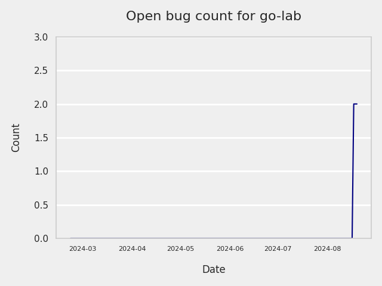
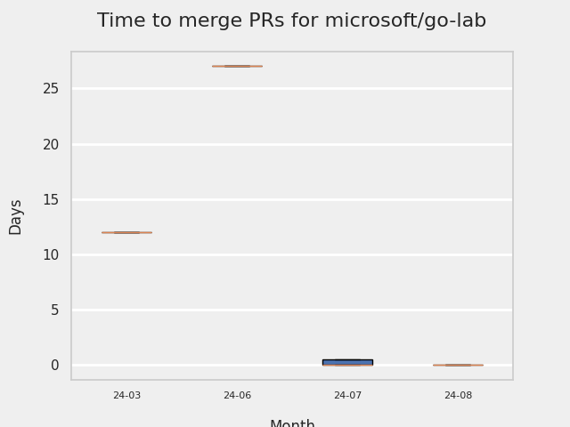
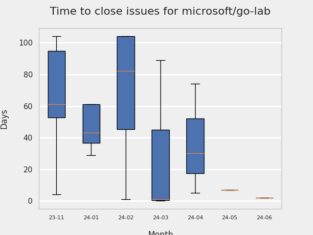
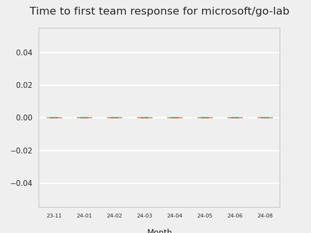
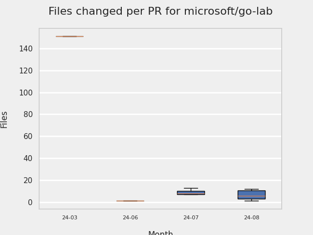

# GITHUB ISSUES REPORT FOR microsoft/go-lab

Generated on 2024-08-20 using: stale=30, all=True

* marks items that are new to report in past 1 day(s)

---

## MOST FREQUENTLY CHANGED FILES (by # of PRs):

  6: rsmigrate/internal/rsmigrate/root.go

  5: go.mod

  5: go.sum

  5: rsmigrate/README.md

