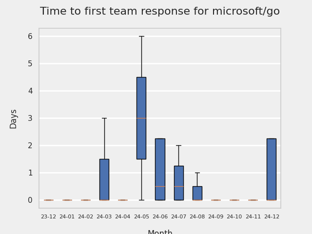

# GITHUB ISSUES REPORT FOR microsoft/go

Generated on 2024-12-09 using: stale=30, all=True

* marks items that are new to report in past 1 day(s)

---

## FOR ISSUES THAT ARE NOT MARKED AS BUGS:

### Issues in go that need a response from team:

| Days Ago | Issue | Title |
| --- | --- | --- |
 |  OP:4  |[1430](https://github.com/microsoft/go/issues/1430 "document ubuntu repo") | document ubuntu repo |
 |  OP:68  |[1347](https://github.com/microsoft/go/issues/1347 "Binaries built with opensslcrypto experiment can sometimes fallback to gocrypto, for historical algorithms") | Binaries built with opensslcrypto experiment can sometimes fallback to gocrypto, for historical algorithms |
 |  OP:487  |[1015](https://github.com/microsoft/go/issues/1015 "Support OpenSSL crypto on Windows") | Support OpenSSL crypto on Windows |
 |  OP:527  |[967](https://github.com/microsoft/go/issues/967 "Plan integrating SHA3 functionality") | Plan integrating SHA3 functionality |

### Issues in go that have comments from OP after last team response:

| Days Ago | Issue | Title |
| --- | --- | --- |
 | \* TM:3, OP:0  |[1429](https://github.com/microsoft/go/issues/1429 "Suggesting to replace syscall.Getenv(&quot;GOFIPS&quot;) with Read registry key")  |Suggesting to replace syscall.Getenv("GOFIPS") with Read registry key |
 |  TM:163, OP:163  |[1255](https://github.com/microsoft/go/issues/1255 "Microsoft defender false positives of Go binaries on windows") | Microsoft defender false positives of Go binaries on windows |

### Issues in go that have no external responses since team response in 30+ days:

| Days Ago | Issue | Title |
| --- | --- | --- |
 |  TM:83  |[1319](https://github.com/microsoft/go/issues/1319 "panic in addTLS in cgo code") | panic in addTLS in cgo code |
 |  TM:132  |[1283](https://github.com/microsoft/go/issues/1283 "OpenSSL version 1.1.1 is not listed under OpenSSL Library's FIPS compliant library list") | OpenSSL version 1.1.1 is not listed under OpenSSL Library's FIPS compliant library list |
 |  TM:153  |[1267](https://github.com/microsoft/go/issues/1267 "Compiling Grafana using FIPS with Microsoft Go 1.21") | Compiling Grafana using FIPS with Microsoft Go 1.21 |
 |  TM:298  |[1143](https://github.com/microsoft/go/issues/1143 "[BEST PRACTICE] To use with unique identifier") | [BEST PRACTICE] To use with unique identifier |
 |  TM:39  |[999](https://github.com/microsoft/go/issues/999 "Query from application whether crypto backend is in FIPS mode") | Query from application whether crypto backend is in FIPS mode |
 |  TM:1007  |[447](https://github.com/microsoft/go/issues/447 "Docker image for microsoft/go") | Docker image for microsoft/go |

## MOST FREQUENTLY CHANGED FILES (by # of PRs):

103: go

 58: patches/0005-Add-CNG-crypto-backend.patch

 37: patches/0004-Add-OpenSSL-crypto-backend.patch

 29: patches/0006-Vendor-crypto-backends.patch

 28: patches/0002-Add-crypto-backend-foundation.patch

 27: eng/_util/go.mod

 26: eng/_util/go.sum

 24: VERSION

 24: eng/pipeline/stages/run-stage.yml

 20: MICROSOFT_REVISION

 16: eng/pipeline/stages/go-builder-matrix-stages.yml

 14: eng/pipeline/stages/builders-to-stages.yml

 13: .github/workflows/codeql.yml

 11: eng/pipeline/rolling-innerloop-pipeline.yml

 11: eng/pipeline/rolling-pipeline.yml

 11: eng/pipeline/rolling-internal-pipeline.yml

 10: patches/0003-Add-BoringSSL-crypto-backend.patch

 10: eng/pipeline/pr-pipeline.yml

 10: eng/doc/fips/UserGuide.md

 10: eng/pipeline/stages/publish-stage.yml

  9: eng/pipeline/pr-outerloop-pipeline.yml

  9: patches/0010-Support-TLS-1.3-in-fipstls-mode.patch

  7: eng/_util/cmd/run-builder/run-builder.go

  6: eng/README.md

  6: eng/_core/cmd/build/build.go

  5: eng/pipeline/stages/sign-stage.yml

  5: eng/utilities.ps1

  5: eng/pipeline/stages/pool-2.yml

  5: eng/pipeline/rolling-internal-validation-pipeline.yml

  5: patches/0011-Replace-RtlGetNtVersionNumbers-with-RtlGetVersion.patch

