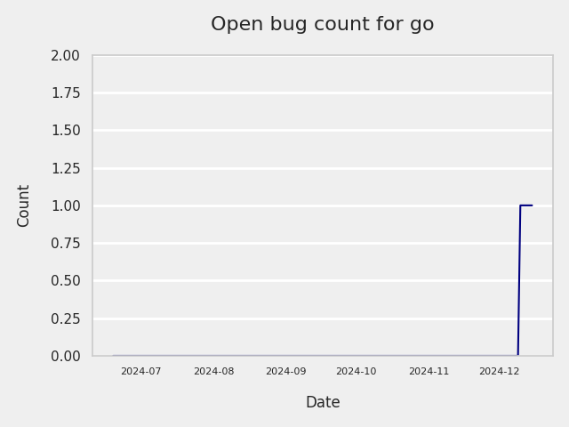
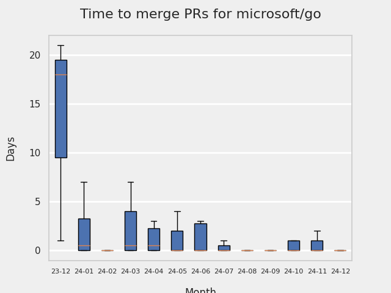

# GITHUB ISSUES REPORT FOR microsoft/go

Generated on 2024-08-20 using: stale=30, all=True

* marks items that are new to report in past 1 day(s)

---

## FOR ISSUES THAT ARE NOT MARKED AS BUGS:

### Issues in go that need a response from team:

| Days Ago | Issue | Title |
| --- | --- | --- |
 |  OP:376  |[1015](https://github.com/microsoft/go/issues/1015 "Support OpenSSL crypto on Windows") | Support OpenSSL crypto on Windows |
 |  OP:416  |[967](https://github.com/microsoft/go/issues/967 "Plan integrating SHA3 functionality") | Plan integrating SHA3 functionality |

### Issues in go that have comments from OP after last team response:

| Days Ago | Issue | Title |
| --- | --- | --- |
 |  TM:52, OP:52  |[1255](https://github.com/microsoft/go/issues/1255 "Microsoft defender false positives of Go binaries on windows") | Microsoft defender false positives of Go binaries on windows |

### Issues in go that have no external responses since team response in 30+ days:

| Days Ago | Issue | Title |
| --- | --- | --- |
 |  TM:42  |[1267](https://github.com/microsoft/go/issues/1267 "Compiling Grafana using FIPS with Microsoft Go 1.21") | Compiling Grafana using FIPS with Microsoft Go 1.21 |
 |  TM:54  |[1253](https://github.com/microsoft/go/issues/1253 "`go tool cover` doesn't work with FIPS mode enabled on Mariner 2.0") | `go tool cover` doesn't work with FIPS mode enabled on Mariner 2.0 |
 |  TM:187  |[1143](https://github.com/microsoft/go/issues/1143 "[BEST PRACTICE] To use with unique identifier") | [BEST PRACTICE] To use with unique identifier |
 |  TM:896  |[447](https://github.com/microsoft/go/issues/447 "Docker image for microsoft/go") | Docker image for microsoft/go |

## MOST FREQUENTLY CHANGED FILES (by # of PRs):

122: go

 41: patches/0005-Add-CNG-crypto-backend.patch

 36: patches/0004-Add-OpenSSL-crypto-backend.patch

 21: VERSION

 21: eng/_util/go.mod

 21: patches/0006-Vendor-crypto-backends.patch

 21: patches/0002-Add-crypto-backend-foundation.patch

 20: eng/_util/go.sum

 19: eng/pipeline/stages/run-stage.yml

 13: patches/0003-Add-BoringSSL-crypto-backend.patch

 12: eng/doc/fips/UserGuide.md

 11: MICROSOFT_REVISION

 10: eng/pipeline/rolling-internal-pipeline.yml

 10: eng/pipeline/stages/builders-to-stages.yml

 10: eng/pipeline/stages/publish-stage.yml

  9: eng/pipeline/stages/go-builder-matrix-stages.yml

  8: patches/0010-Support-TLS-1.3-in-fipstls-mode.patch

  7: eng/_util/cmd/run-builder/run-builder.go

  6: eng/pipeline/rolling-innerloop-pipeline.yml

  6: eng/pipeline/rolling-pipeline.yml

  6: eng/_core/cmd/build/build.go

  6: eng/doc/fips/README.md

  5: eng/pipeline/rolling-internal-validation-pipeline.yml

  5: patches/0011-Replace-RtlGetNtVersionNumbers-with-RtlGetVersion.patch

  5: eng/pipeline/pr-pipeline.yml

